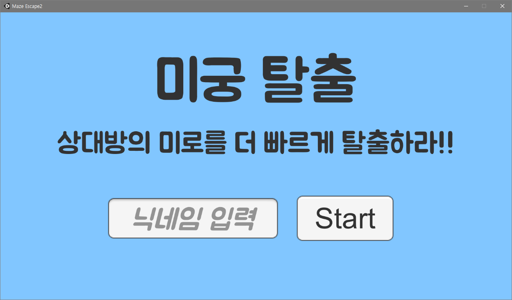
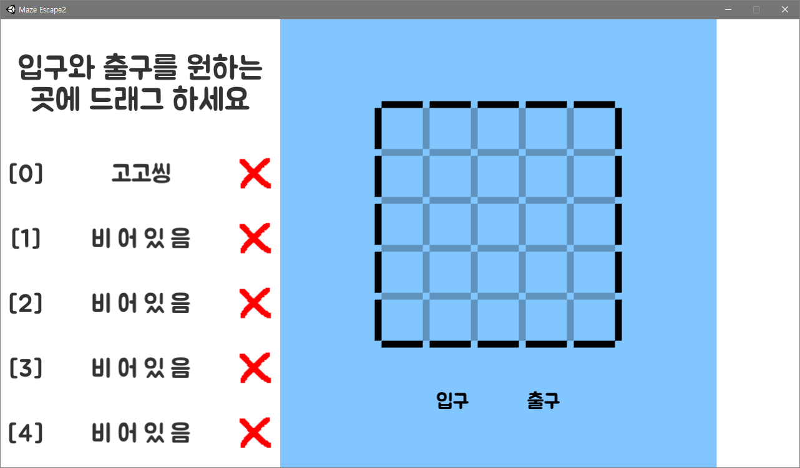
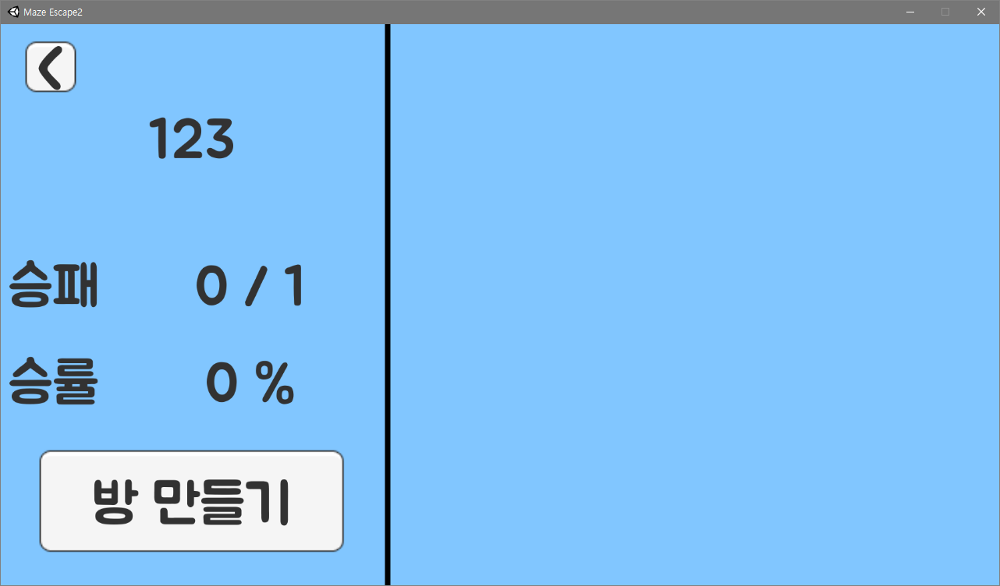
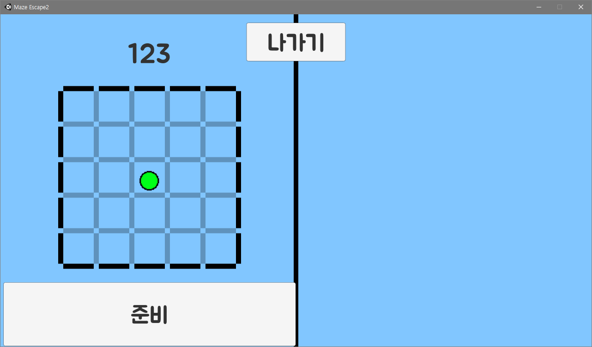

# Maze Escape

## 1. 닉네임을 입력합니다.

## 2. 프리셋을 등록합니다.

## 3. 로비에서 방에 들어가거나 방을 만듭니다.

## 4. 2명의 플레이어가 모이고 모두 레디를 하면 게임이 시작됩니다.

[게임 설명]

상대방이 짜놓은 미로를 먼저 탈출하는 쪽이 승리하는 게임입니다. 자신의 턴에 방향키로 움직일 수 있습니다.
벽에 가로막히는 경우 그 문은 빨간색으로 표시됩니다.

[조작법]

이동 : 방향키
스페이스바 : 턴 넘기기
